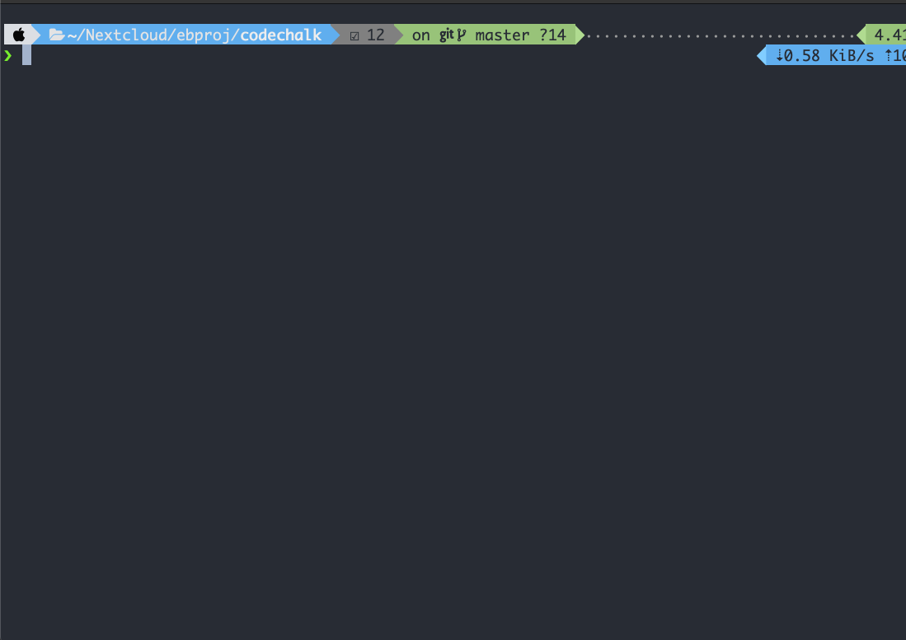

# CodeChalk
> ⚙ Simple and neat terminal demo code outputs

CodeChalk is a simple util to help you highlighting demo code outputs to terminal.Especially suitable to use in your CLI programs or template generators, showing some simple code blocks to help your users to quickly get started.


### Demo

Using default highlighter to highlight the example code



### Usage

Install
```shell
# Using Yarn
yarn add codechalk --dev
# Using NPM
npm install codechalk -D
```


Highlight your code

```typescript
import { highlight } from 'codechalk'

/** Step 1: Render the desired content using highlight */
const output = await highlight(`export async function test(target?: ApiEnvParam): boolean {
  const templateFile = await generateTemplateFromTarget(target)
  if (templateFile.hasError) return false
  switch (templateFile.type) {
    case SUCCESS:
    case INFO:
      return true
    default:
      return false
  }
}
`, 'ts')

/** Step 2: Log the output */
console.log(output)
```


### API introductions

CodeChalk is a small util that only contains 2 exported functions.


#### highlight

API Definition

```typescript
async function highlight(code: string, lang='javascript', theme='monokai'): Promise<string>
```

Usage

```typescript
/** Default render - using jsParser + monokai theme */
const result1 = await highlight('console.log("hahaha")')

/** Customize render - using TypeScript + monokai theme */
const result2 = await highlight('console.log("hahaha")', 'ts')

/** Customize render - using TypeScript + one-dark-pro theme */
const result3 = await highlight('console.log("hahaha")', 'ts', 'one-dark-pro')
```


#### configureShiki

API Definition

```typescript
function configureShiki(options: Partial<ShikiHighlighterOptions>): void
```

Usage

```typescript
/** Full usage, see Shiki's configuration demo */
configureShiki({
  /** Preload syntax parsers */
  langs: ['javascript', 'css', 'html', 'vue-html', 'typescript', 'jsx', 'tsx'],
  /** Preload themes */
  themes: ['monokai', 'one-dark-pro', 'material-darker']
})

/** After configured, call shiki for perform highlighting */
const output = await highlight(`export async function test(target?: ApiEnvParam): boolean {
  const templateFile = await generateTemplateFromTarget(target)
  if (templateFile.hasError) return false
  switch (templateFile.type) {
    case SUCCESS:
    case INFO:
      return true
    default:
      return false
  }
}
`, 'ts')
console.log(output)

```


### Credits

- CodeChalk uses [Shiki](https://github.com/shikijs/shiki) to generate highlighted code tokens.
- Meanwhile, CodeChalk relies [Chalk](https://github.com/chalk/chalk) for styling up text in terminal.


### License

MIT © [Souler Ou](https://github.com/a20185)